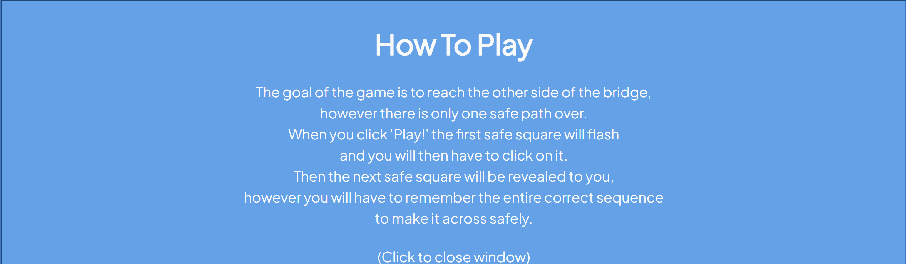
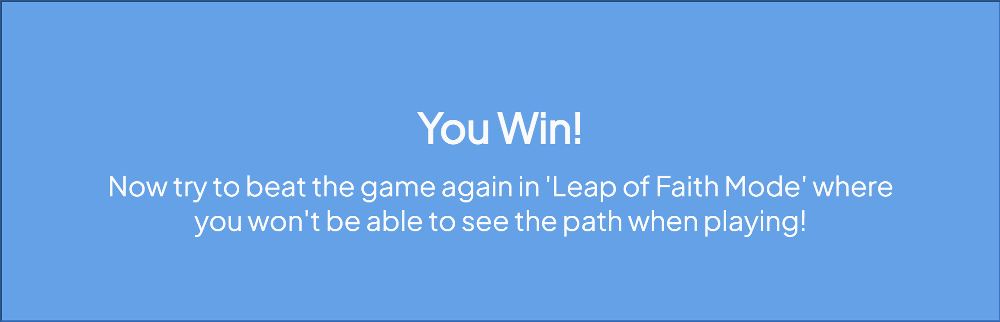
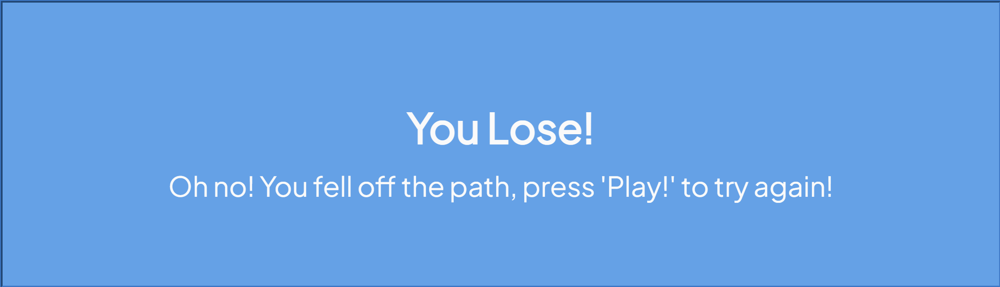
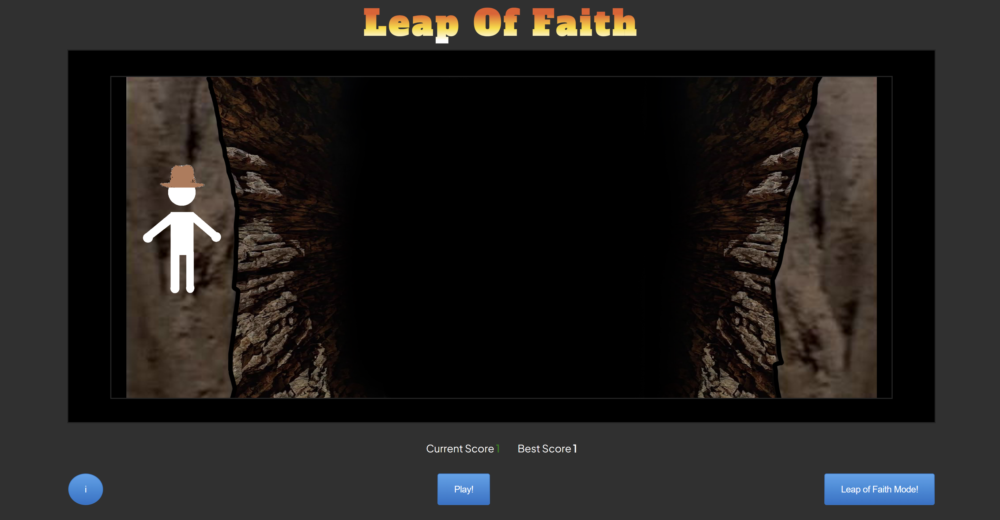
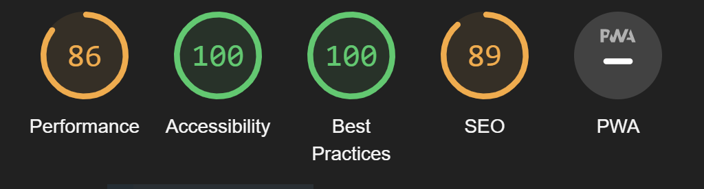

# Leap of Faith 


Website's purpose is to allow users to play an entertaining memory game where they have to remember the correct sequence of tiles and build a path across a ravine. This game was inspired by a scene from Indiana Jones and the Last Crusade so once the player has beaten the game once they unlock a new way to play where they can't see the tiles to click.

The main aim for this project was to create a game that used javascript in combination with CSS and Html.

## Features

### Existing Features

 - The Heading
    - Featured at the top of the page, the name of the game is displayed and is easy for the user to read upon loading the page. The color scheme and font used are inspired by The Indiana Jones title cards from the films.


 - The Game Area
    - Within a black border the game area is displayed.
    - It is made up of a background showing an image of a ravine the player must try to cross, there is a stick figure which is meant to represent the player "character". They are just a part of the background however. When the player wins the game the stick figure moves from one side of the ravine to the other (shown in figure below).
    - The interactable part of the play area is the 3x10 grid of tiles which are used to play the game. When the user starts the game the website generates and array of 10 numbers which correlate to one square per column in a sequence. generated by this code: 
``` 
    function pathBuild(i) {
	    if (i < 1) {
		    pattern.push(Math.floor(Math.random() * 3 + 1));
	    } else if (i < 2) {
		    pattern.push(Math.floor(Math.random() * 3 + 4));
	    } else if (i < 3) {
		    pattern.push(Math.floor(Math.random() * 3 + 7));
	    } else if (i < 4) {
		    pattern.push(Math.floor(Math.random() * 3 + 10));
	    } else if (i < 5) {
		    pattern.push(Math.floor(Math.random() * 3 + 13));
    	} else if (i < 6) {
		    pattern.push(Math.floor(Math.random() * 3 + 16));
	    } else if (i < 7) {
		    pattern.push(Math.floor(Math.random() * 3 + 19));
    	} else if (i < 8) {
		    pattern.push(Math.floor(Math.random() * 3 + 22));
	    } else if (i < 9) {
		    pattern.push(Math.floor(Math.random() * 3 + 25));
	    } else if (i < 10) {
		    pattern.push(Math.floor(Math.random() * 3 + 27));
	    }
    }
```
 - The game will then take a 'computer turn' where the tiles are not interactable but an animation will play where a square will light up yellow in columns up to which round it is (eg, in round 1 only the first column lights up, in round 2 the first and second light up...etc.). After the animation sequence has finished the player will then be able to click on the tiles, when the player clicks a tile this code is run:
 ```
function check() {
	if (playerPattern[playerPattern.length - 1] !== pattern[playerPattern.length - 1])
		good = false;

	if (playerPattern.length == 10 && good) {
		gameWin();
	}

	if (good == false) {
		gameLose();
	}

	if (score == playerPattern.length && good && !win) {
		score++;
		scoreCounter.innerHTML = score - 1;
		playerPattern = [];
		compTurn = true;
		flash = 0;
		intervalId = setInterval(gameTurn, 800);
	}
}
 ```
 - This checks to see if the player clicked the correct tile. If they didn't then the game is lost, the lose message will come up and the correct tile pattern will be shown in red. If they did then the game checks to see if they've won, the win message comes up, the background changes to the win scenario, and the secret 'leap of faith mode' button becomes visible. If the player has not won but was correct then the game checks to see if they have reached the end of the pattern, if not then the round continues, if they have then the computer takes it's turn to play the animation for the next round.


 - The Score Area
    - In this area the current score of the player is shown for the iteration of the game they are currently playing.
    - When the game is lost or won the current score is compared to the best score value and if it higher then it replaces the best score value so that the player can keep track of the furthest they have gotten in the game.


 -  Control Area 
    - The 'i' button here calls up the information on how to play the game.
    - The Play button commences the game.
    - The Leap of Faith Mode is hidden by default and only appears when the game has been beaten once.


 - How to Play
    - The instructions for the game are in a box that is hidden by default but can be called when the information button is pressed.
    - The box can be hidden again by clicking it.




 - Win screen
    - When the game is won this box appears and alerts the player that they've won and unlocked Leap of Faith Mode.
    - This box is hidden by clicking it.



 -  Lose screen
    - When the player has pressed the wrong tile the lose message appears.
    - This box is hidden by clicking it.



 - Alternate Game mode
    - When the Leap of Faith Mode button is pressed this alternative version of the game is started.
    - The background player character changes so that it is clear they are on a different version of the game.
    - After the player is shown the sequence they have to repeat the tiles are hidden from them but are still interactable.



### Future Features

 - Difficulty settings
    - In the future I would consider adding difficulty settings to the game which change the amount of tiles on the game area and generate longer sequences.

- Random Mode
    - A mode where the goal isnt to get across but just remember the order of tiles which could be any of the 30 in any order. Game would last either to round 30 or allow repeats in the sequence for an infinite mode.

## Testing

### Validator Testing

- HTML
    - No errors were returned when passing through the official [W3C validator](https://validator.w3.org/).

- CSS
    - No errors were found when passing through the official [(Jigsaw) validator](https://jigsaw.w3.org/css-validator/)

- Javascript
    - Errors and formatting were checked and corrected using [javascript validator](https://jshint.com/)

### Compatibility Testing

Site was tested across multiple virtual devices through chrome developor tools.

Site was tested to work on Google chrome, firefox, microsoft edge and internet explorer.

### Performance Testing

I generated a lighthouse report for the website.



### Unfixed Bugs

There are currently no known bugs in the website.

## Deployment

- The site was deployed to GitHub pages. The steps to deploy are as follows
    - In the Github repository, navigate to the Settings tab
    - From the source section drop-down menu, select the Master Branch
    - Once the master branch has been selected, the page will be automatically refreshed with a detailed ribbon display to indicate the successful deployment.

The live link can be found here - https://ryandteague.github.io/JavaScript-Game1/  

## Credits

- To complete this project I used Code Institute student template: [gitpod full template](https://github.com/Code-Institute-Org/gitpod-full-template)

### Code

Button Design: https://getcssscan.com/css-buttons-examples

The skeleton of this game's code was adapted from this tutorial for a simon game: https://www.youtube.com/watch?v=n_ec3eowFLQ

### Photos
The Background image was created by using Paint and a screenshot from Indiana Jones and the Last Crusade.

