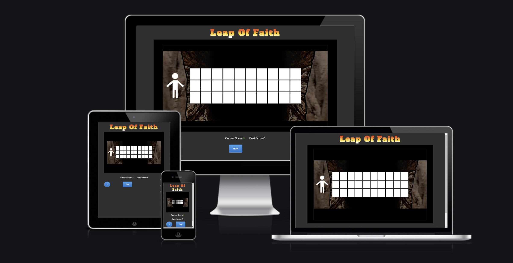

# Leap of Faith 



Website's purpose is to allow users to play an entertaining memory game where they have to remember the correct sequence of tiles and build a path across a ravine. This game was inspired by a scene from Indiana Jones and the Last Crusade so once the player has beaten the game once they unlock a new way to play where they can't see the tiles to click.

The main aim for this project was to create a game that used javascript in combination with CSS and Html.

## Features

### Existing Features

 - The Heading
    - Featured at the top of the page, the name of the game is displayed and is easy for the user to read upon loading the page. The color scheme and font used are inspired by The Indiana Jones title cards from the films.


 - The Game Area
    - Within a black border the game area is displayed.
    - It is made up of a background showing an image of a ravine the player must try to cross, there is a stick figure which is meant to represent the player "character". They are just a part of the background however. When the player wins the game the stick figure moves from one side of the ravine to the other (shown in figure below).
    - The interactable part of the play area is the 3x10 grid of tiles which are used to play the game. When the user starts the game the website generates and array of 10 numbers which correlate to one square per column in a sequence. generated by this code: 
``` 
    function pathBuild(i) {
	    if (i < 1) {
		    pattern.push(Math.floor(Math.random() * 3 + 1));
	    } else if (i < 2) {
		    pattern.push(Math.floor(Math.random() * 3 + 4));
	    } else if (i < 3) {
		    pattern.push(Math.floor(Math.random() * 3 + 7));
	    } else if (i < 4) {
		    pattern.push(Math.floor(Math.random() * 3 + 10));
	    } else if (i < 5) {
		    pattern.push(Math.floor(Math.random() * 3 + 13));
    	} else if (i < 6) {
		    pattern.push(Math.floor(Math.random() * 3 + 16));
	    } else if (i < 7) {
		    pattern.push(Math.floor(Math.random() * 3 + 19));
    	} else if (i < 8) {
		    pattern.push(Math.floor(Math.random() * 3 + 22));
	    } else if (i < 9) {
		    pattern.push(Math.floor(Math.random() * 3 + 25));
	    } else if (i < 10) {
		    pattern.push(Math.floor(Math.random() * 3 + 27));
	    }
    }
```
 - The game will then take a 'computer turn' where the tiles are not interactable but an animation will play where a square will light up yellow in columns up to which round it is (eg, in round 1 only the first column lights up, in round 2 the first and second light up...etc.). After the animation sequence has finished the player will then be able to click on the tiles, when the player clicks a tile this code is run:
 ```
function check() {
	if (playerPattern[playerPattern.length - 1] !== pattern[playerPattern.length - 1])
		good = false;

	if (playerPattern.length == 10 && good) {
		gameWin();
	}

	if (good == false) {
		gameLose();
	}

	if (score == playerPattern.length && good && !win) {
		score++;
		scoreCounter.innerHTML = score - 1;
		playerPattern = [];
		compTurn = true;
		flash = 0;
		intervalId = setInterval(gameTurn, 800);
	}
}
 ```
 - This checks to see if the player clicked the correct tile. If they didn't then the game is lost, the lose message will come up and the correct tile pattern will be shown in red. If they did then the game checks to see if they've won, the win message comes up, the background changes to the win scenario, and the secret 'leap of faith mode' button becomes visible. If the player has not won but was correct then the game checks to see if they have reached the end of the pattern, if not then the round continues, if they have then the computer takes it's turn to play the animation for the next round.


 - The Score Area
    - In this area the current score of the player is shown for the iteration of the game they are currently playing.
    - When the game is lost or won the current score is compared to the best score value and if it higher then it replaces the best score value so that the player can keep track of the furthest they have gotten in the game.


 -  Control Area 
    - The blue ticket button is fixed onto the bottom right corner of every page except the tickets page. This is so at any point when viewing the information a user doesn't have to scroll or look for navigation if they decide they want to go to the festival.


 - How to Play
    - The amenities section supplies the user with information on what there is to do at the festival. 
    - For the relvant topics there are links to take the user directly to where they can find out more information.


 - Win screen
    - The imbeded map here allows the user to click out directly to google maps to get directions for the festival.


 -  Lose screen
    - The footer contains responsive links to different social media sites which is valuable as it encourages the user to stay connected to the festival's media.
    - There is also an envelope icon that will take the user to the mailing list form.


 - Alternate Game mode
    - The tickets section displays the options for all the different types of tickets the user can purchase.
    - There is a responsiveness to the ticket boxes so that the user is aware of where their mouse is at any one time.
    - As the tickets are not on sale yet there is a link to the mailing list within each ticket field so that the user can sign up and be informed when tickets are available.


### Future Features

 - Ticket Purchase
    - Once tickets are available to purchase the tickets section will need to be updated with links to a page where users will be able to enter their payment information for buying the tickets they want.

## Testing

### Validator Testing

- HTML
    - No errors were returned when passing through the official [W3C validator](https://validator.w3.org/).

- CSS
    - No errors were found when passing through the official [(Jigsaw) validator](https://jigsaw.w3.org/css-validator/)

### Compatibility Testing

Site was tested across multiple virtual devices through chrome developor tools.

Site was tested to work on Google chrome, firefox, microsoft edge and internet explorer, although hero image animation does not play on internet explorer.

### Performance Testing

I generated lighthouse reports for each page of the website, mainly looking to achieve a high accessibility score.

Landing Page: 


Line-up and Tickets Page:


Mailing List Page:


Gallery Page: 


### Unfixed Bugs

There are currently no known bugs in the website.

## Deployment

- The site was deployed to GitHub pages. The steps to deploy are as follows
    - In the Github repository, navigate to the Settings tab
    - From the source section drop-down menu, select the Master Branch
    - Once the master branch has been selected, the page will be automatically refreshed with a detailed ribbon display to indicate the successful deployment.

The live link can be found here - https://ryandteague.github.io/DisCoe/index.html    

## Credits

- To complete this project I used Code Institute student template: [gitpod full template](https://github.com/Code-Institute-Org/gitpod-full-template)

### Code

Countdown: https://www.w3schools.com/howto/howto_js_countdown.asp

Drop Down Menu: https://css-tricks.com/convert-menu-to-dropdown/

### Maps

https://www.google.co.uk/maps

### Photos

Pexels:

    - https://www.pexels.com/photo/people-gathering-near-stage-with-fireworks-1306791/
    - https://www.pexels.com/photo/person-playing-sun-burst-electric-bass-guitar-in-bokeh-photography-96380/
    - https://www.pexels.com/photo/photo-of-juicy-burger-on-wooden-surface-1639565/
    - https://www.pexels.com/photo/an-amusement-park-at-night-2884693/
    - https://www.pexels.com/photo/silhouette-of-person-standing-near-camping-tent-2398220/
    - https://www.pexels.com/photo/people-at-concert-1105666/
    - https://www.pexels.com/photo/photo-of-pitched-dome-tents-overlooking-mountain-ranges-1687845/
    - https://www.pexels.com/photo/photo-of-teepee-under-a-starry-sky-2666598/
    - https://www.pexels.com/photo/people-having-a-concert-1190297/
    - https://www.pexels.com/photo/people-standing-in-front-of-stage-1267317/
    - https://pixabay.com/photos/concert-crowd-silhouette-3084876/
    - https://www.pexels.com/photo/person-wearing-white-shirt-standing-120066/
    - https://www.pexels.com/photo/photo-of-crowd-of-people-1167034/
    - https://www.pexels.com/photo/two-women-embracing-surrounded-by-crowd-1537638/
    - https://www.pexels.com/photo/photo-of-fireworks-during-nighttime-1259614/
    - https://www.pexels.com/photo/stage-lights-2263435/
    - https://www.pexels.com/photo/woman-facing-ferris-wheel-while-making-heart-hand-sign-1405422/
    - https://www.pexels.com/photo/red-haired-fire-dancer-blowing-rod-with-flames-167386/
    - https://www.pexels.com/photo/man-in-denim-long-sleeves-playing-acoustic-guitar-3776838/
    - https://www.pexels.com/photo/woman-receives-her-takeaway-taco-food-8448070/
    - https://www.pexels.com/photo/tents-on-green-grass-field-near-mountain-116104/
    - https://www.pexels.com/photo/man-in-blue-denim-button-up-shirt-and-woman-in-white-floral-shirt-5779485/
    - https://www.pexels.com/photo/man-in-blue-denim-button-up-shirt-and-woman-in-white-floral-shirt-5779485/
    
Unsplash:

    - https://unsplash.com/photos/fpHiMJWjhH0/
    - https://unsplash.com/photos/DSB1MZWsGco/


### Icons

https://fontawesome.com/
